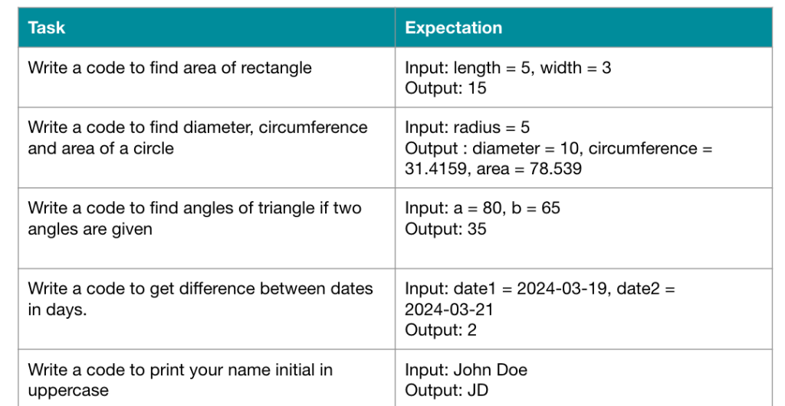

# Tugas mata kuliah Web Client Development

## 📌 Deskripsi

Repositori ini berisi implementasi JavaScript untuk beberapa tugas pemrograman dasar, seperti menghitung luas persegi panjang, menghitung sifat-sifat lingkaran, menentukan sudut segitiga, menghitung selisih tanggal, dan mengambil inisial dari nama.

## 📋 Tugas yang Dikerjakan

1️⃣ Menghitung Luas Persegi Panjang

Fungsi: hitungLuasPersegiPanjang(panjang, lebar)

Deskripsi: Menghitung luas persegi panjang dengan rumus panjang × lebar.

Contoh Penggunaan:

console.log(hitungLuasPersegiPanjang(5, 3)); // Output: 15

#

2️⃣ Menghitung Diameter, Keliling, dan Luas Lingkaran

Fungsi: hitungLingkaran(jariJari)

Deskripsi: Menghitung diameter, keliling, dan luas lingkaran berdasarkan jari-jari yang diberikan.

Rumus:

Diameter = 2 × jari-jari

Keliling = 2 × π × jari-jari

Luas = π × jari-jari²

Contoh Penggunaan:

hitungLingkaran(5);
// Output: diameter = 10, keliling = 31.4159, luas = 78.539

3️⃣ Menentukan Sudut Ketiga dari Segitiga

Fungsi: hitungSudutKetiga(sudutA, sudutB)

Deskripsi: Menentukan sudut ketiga dari segitiga berdasarkan dua sudut yang diketahui.

Rumus: 180 - (sudutA + sudutB)

Contoh Penggunaan:

console.log(hitungSudutKetiga(80, 65)); // Output: 35

4️⃣ Menghitung Selisih Hari antara Dua Tanggal

Fungsi: selisihHari(tanggal1, tanggal2)

Deskripsi: Menghitung jumlah hari antara dua tanggal yang diberikan dalam format YYYY-MM-DD.

Contoh Penggunaan:

console.log(selisihHari("2024-03-19", "2024-03-21")); // Output: 2

5️⃣ Mengambil Inisial dari Nama

Fungsi: ambilInisial(nama)

Deskripsi: Mengambil huruf pertama dari setiap kata dalam nama dan mengubahnya menjadi huruf besar.

Contoh Penggunaan:

console.log(ambilInisial("John Doe")); // Output: JD

